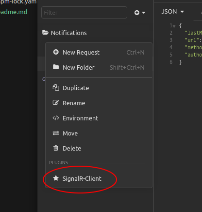
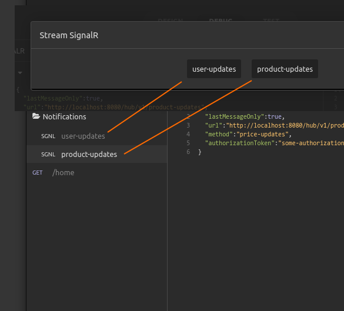
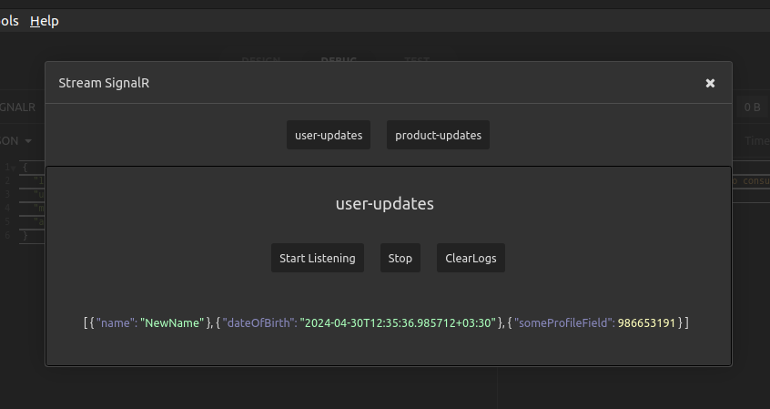
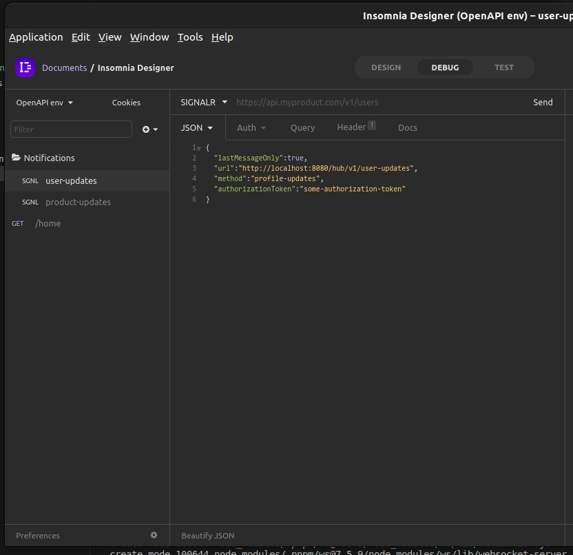

Signal-R Client
===============

How To Use
----------

This plugin adds a ___SignalR-Client___ item to the request directory action menu. By clicking this, SignalR Client's window will pop, showing a list of available SignalR requests in the directory.







Clicking on any of these buttons, will provide you with the signal r client window for that request. Signal-R requests are describe later in this document.


The SignalR Client Window Provides a _Start Listening_ button, a _Stop_ button and a _Clear Logs_ button. When listening to signal r channel has been started, the data would be logged underneath the buttons in json format.




Signal-R Requests And Panel Options
-----------------------------------

Each request can define configurations and options to run a client for a specific signal-r channel. Creating a signal-r request is no different than creating http requests. By selecting the _New Request (Ctrl+N)_ item from the menu you can get to the new request window. By default it will suggest to create an Http-GET request with the name of your choice. You can change the request type with the drop-down right next to the name input box. There, you should click ___Custom Method___ options from the menu, then write __"SIGNALR"__ in the input box as the name of the request type (Method).
Then you need to choose the _Json_ body type for your request so that you can write signal-r configurations as json in the request body:



| Property           | Type       | Description        |
|:------------------:|:----------:|:-------------------|
| ```lastMessageOnly```    |  boolean   | if  ```true```, whenever a new message is received, the previously received messages will be deleted |
|```url``` | string | The server address and signal-r hub uri|
| ```method``` | string | The signal-r hub's method which your client is supposed to listen to|
| ```authorizationToken``` | string | If the signal-r server needs an authorization token for authorizing it's clients, you can add this property to provide that|


✅ You can use template tags in request body, for example you can create another request to do the authorization and then pick the authorization token from it and use in it in the request.

__Example:__

```json
{
	"lastMessageOnly":true,
	"url":"http://localhost:8080/hub/v1/user-updates",
	"method":"profile-updates",
	"authorizationToken":"some-authorization-token"
}
```


How to install
---------------

__Using Insomnia Hub:__ You can navigate to [Insomnia Plugin Hub Page](https://insomnia.rest/plugins) and search for __Signal-R Client__, Open the details page and click __Install Plugin__ button. This throw an installation link which you can open with your insomnia on your desktop.


__Directly installing the zip file:__: You can [download](https://github.com/Acidmanic/insomnia-plugin-signalr-plugin/archive/refs/heads/master.zip) project zip file from github. 
Then extract the content into a directory at your [insomnia's plugin's directory](https://docs.insomnia.rest/insomnia/introduction-to-plugins#plugin-file-location).


__Using Insomnia Application:__ You can Open your insomnia application, go to Preferences menu, open the plugins tab and enter the name __insomnia-plugin-signalr-plugin__ into text box, the click __Install Plugin__ button.
